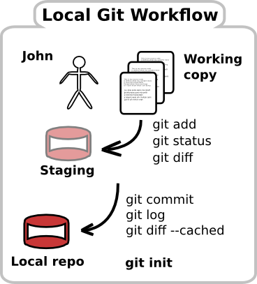

title: Clone the Github repository
---

You previously created a repository on Github so that you can share your code and versions with others.  However the changes to your source code files happen on your laptop, so we need to first make a copy of the Github repository on your laptop.  

We take a complete copy of the repository on Github repository with all its history, creating an exact clone of it locally on the laptop.  This is called **Cloning** and uses the command `git clone alias URL [directory]`, where `alias` is the short name for the repository `URL` and `directory` is an optional directory in which to create the repository

## Clone your Github repository

Change into a suitable directory on your laptop, eg `my-projects`.  Then clone the Github repository using the command:

    git clone github git@github.com:jr0cket/git-basics-example git-basics
 
 
This creates a directory called `git-basics`.  Inside this directory is another called .git which is your local copy of the repository (_so dont delete the .git directory_)
    

   

## Create a local Git repository 

Now you have a project you want to version, we are going to create a local repository 
Change into the new folder created for your project.  Then create a new git repository using the git initialise command:

    cd my-projects   
    git init

You have just created an empty *local* git repository.  In effect, you have created the *.git* folder within your project that will contain all the change history and changes themselves as the project develops.  You dont need to understand what goes on in the .git folder, but you do need to remember that if you delete it then all your change history is deleted.

## Viewing changes to files (working copy)

To see what changes you could commit to git, use the git status command:

    git status

If you have files in your project they will show up as untracked files when you do a git status.  This means that these files have yet to be put under git version control.  You will soon see that *git status* is used all the time to let you know what the current situation is with your changes.

## Preparing to version your changes

To tell git what changes you want to version, you tell git which files you want to add to make up part of the next commit using the *git add* command.  You can specify a particular file or you can add all files at once.

To add a specific file

    git add filename.ext

To add all files that have been altered or added to the working copy since the last commit:

    git add .

Adding files to git is not the same as doing a commit.  With *git add* you are preparing one or more files to be committed.  When you add a file, it is placed in what is called the staging area (or index).  Staging files is a useful way to group changes over multiple files in order to make a meaningful commit.  In [Chapter 7 - the local git workflow](#chapter07), we will cover the staging area and other steps in Git.

To see what files are staged at any time, you use the *git status* command.

# Commit your changes to the local repository

When you have told git about all the changes you want to add, you use the `git commit` command.  

For each commit, you should provide a meaningful message that explains what you have commited.  When you run the commit command, your default editor will open for you to type in the commit message.  Alternativley you can specify the message with the `-m` option

    git commit -m "meaningful message describing the commit"

For additional changes you continue the cycle of adding files (staging them) and then committing those changes.  This gives you a very detailed history of changes, so you can see how the project has evolved, step back in time and more easily merge changes from different developers.

    # edit files
    git add filename
    git commit -m "describe the change"

# Viewing the history of changes

You can see all the changes that have been committed to your local repository using the `git log` command.

By default, `git log` shows a very verbose commit history.  Using options with the git log command you can make the output easier to read.

    git log --oneline --graph --decorate 

* `--oneline` shows the commit details on a single line 
* `--graph` shows where branches and merges have been made in the history
* `--decorate` shows which commit version 

[TODO: image of git log]

